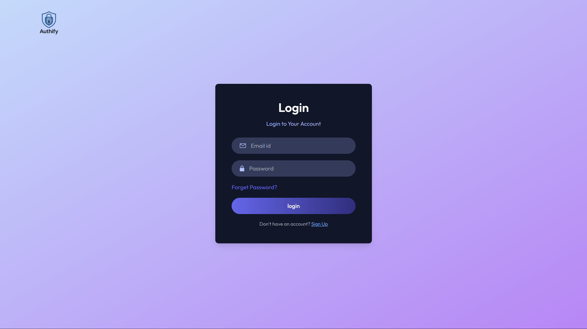

# Email-Based Authentication System

This project is a full-stack email-based authentication system built using **React.js** for the frontend and **Node.js + Express + MongoDB** for the backend. It supports user registration, login, OTP-based email verification, and protected routes with JWT-based session management.

---

## Features

- User Registration and Login
- Email-based OTP verification
- Secure password hashing
- JWT-based authentication
- Protected routes for verified users
- React Context API for frontend auth state management
- MongoDB for persistent user and OTP storage

---

## Project Structure

```
Authify/
│
├── client/
│   ├── public/
│   │   └── index.html
│   ├── src/
│   │   ├── assets/
│   │   │   └── assets.js
│   │   │   └── logo.png
│   │   ├── context/
│   │   │   └── AppContext.jsx
│   │   ├── pages/
│   │   │   └── Home.jsx
│   │   │   └── Login.jsx
│   │   │   └── Register.jsx
│   │   │   └── EmailVerify.jsx
│   │   │   └── ResetPassword.jsx
│   │   │   └── Dashboard.jsx
│   │   ├── App.jsx
│   │   ├── main.jsx
│   │   └── index.css
│   ├── package.json
│   ├── README.md
│   └── .env
│
├── server/
│   ├── config/
│   │   └── mongodb.js
│   │   └── nodemailer.js
│   │   └── emailTemplate.js
│   ├── controllers/
│   │   └── authController.js
│   ├── middleware/
│   │   └── userAuth.js
│   ├── models/
│   │   └── userModel.js
│   ├── routes/
│   │   └── authRoutes.js
│   │   └── userRoutes.js
│   ├── server.js
│   ├── package.json
│   ├── package-lock.json
│   └── .env
│
└── README.md
```

---

## Architecture Diagram

This diagram shows the high-level architecture of the entire authentication flow:


---

## How It Works

1. **User Registration**
   - User fills out registration form in the frontend.
   - Sends `POST /register` to backend.
   - Backend creates user and sends OTP email.
   - OTP stored in MongoDB temporarily.

2. **OTP Verification**
   - User enters OTP in the frontend.
   - Sends `POST /verify-otp` to backend.
   - If OTP is valid, user is marked as verified.

3. **Login**
   - User logs in with email and password.
   - If verified, backend sends JWT token.

4. **Accessing Protected Routes**
   - JWT token is stored in frontend context/localStorage.
   - Token is sent in headers to access protected routes.

---

## Tech Stack

### Frontend

- React.js
- Axios
- React Router
- Context API

### Backend

- Node.js
- Express.js
- MongoDB (Mongoose)
- JWT
- Nodemailer

---

## Sample Screenshots

### Login Page


### OTP Example


### OTP Mail 


### Dashboard (Pre Login)


### Dashboard (Post Login)


### MongoDB UserModel


---

## Installation Guide

### 1. Clone the Repository

```bash
git clone https://github.com/DarshanLoni/Authify.git
cd Authify
```

### 2. Setup Backend

```bash
cd server
npm install
```

Create a `.env` file inside the `server/` folder using the template below:

```
PORT=5000
MONGODB_URI=your_mongodb_connection_string
JWT_SECRET=your_jwt_secret
EMAIL_USER=your_email_address
EMAIL_PASS=your_email_password_or_app_password
```

Start the backend server:

```bash
npm start
```

### 3. Setup Frontend

```bash
cd ../client
npm install
npm start
```

The frontend will run on [http://localhost:3000](http://localhost:3000) and the backend on [http://localhost:5000](http://localhost:5000).

---

## Project Breakdown

### Client

- `pages/Register.js`: Registration and OTP input
- `pages/Login.js`: Login form
- `pages/Dashboard.js`: Protected route (JWT)
- `context/AuthContext.js`: Manages login/logout state
- `App.js`: Routing and layout

### Server

- `controllers/authController.js`: Handles register, OTP verify, login
- `routes/authRoutes.js`: Express routes
- `models/User.js`: Mongoose schema for users
- `models/Otp.js`: Mongoose schema for OTPs with expiry
- `utils/emailService.js`: Sends OTP using nodemailer
- `middleware/auth.js`: JWT token verification